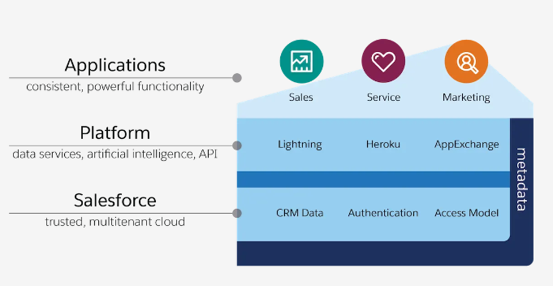
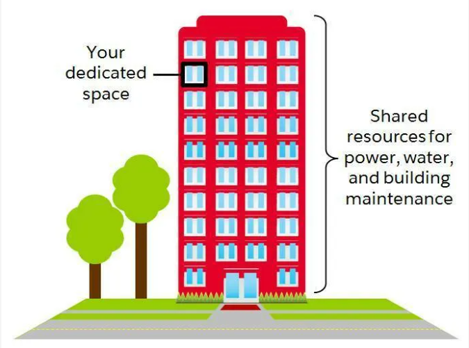
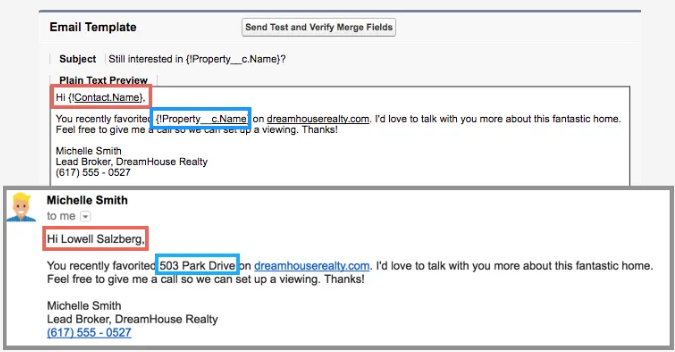

## About Salesforce Architecture

**What is the Salesforce architecture?**

You can think of the Salesforce architecture as a layer structure that overlaps many layers. Imagine something like a delicious cake and it might be easy to stick with.

**Importance of Salesforce architecture?**

- Salesforce is a cloud company. So everything we offer is in a reliable multi-tenant cloud.
- Salesforce Platform is the foundation of our services. The platform is equipped with metadata and consists of various elements such as data services, artificial intelligence and robust APIs for development.
- All our applications are on the platform. Pre-created products like Sales Cloud and Marketing Cloud Engagement, as well as applications that developers have built using this platform, have consistent and powerful features.
- And everything is integrated. Every product we offer and every developer builds incorporates Salesforce's platform technology, including predictive analytics and development frameworks.

**Note:** - To understand this architecture, we need to suppress particularly important terms such as trust, multi-tenancy, metadata, and API.

**Reasons to trust the cloud**
- Trust is a top priority.
- Not only do you store sensitive data in your organization, but we also build features on our platform that are essential to the success of your company.
- Our responsibility to ensure the safety of your data and functions is not neglected and we remain transparent to our services for that purpose.
- is a very important resource.
- (trust.salesforce.com)
    - this site allows you to browse performance data and see information on how to protect your data. 
    - will also be notified on this site if the maintenance we are planning may affect your access to Salesforce.

**Sharing in the multi-tenant cloud requires consideration**
- Salesforce is an apartment-like structure.
- Your company reserves its own space in the cloud, but there are various neighbors near it, from privately owned shops to multinational corporations.

- Salesforce offers a range of core services to all of our customers in a multi-tenant cloud.
- Customers access the same calculation, data storage, and core functions regardless of the size of their business.
- Trust and multi-tenancy are closely linked.
- sharing space with other companies, you can trust that Salesforce keeps your data safe.
- also be confident that you can take advantage of the latest and best features with 3 seamless automatic upgrades per year.
- Salesforce is a cloud service, so you don't have to install new features or worry about your hardware.
- It's also multi-tenancy that makes all this possible.

**Metadata magic**
- it means a shell that holds content related to the information we want to collect in the Salesforce organization.
- DreamHouse colleague enters and displays property data when using Salesforce.
- Metadata is also page layouts, security settings, and other customizations made to the structure of an organization to collect or use organizational data.
- geolocation information on the map to refer to addresses and collect information about trading partners who can associate with multiple objects.
- Salesforce has the opportunity to store and make available the metadata you create right away.

**Everything about API**
- application programming interface (API ) allows you to connect various software to each other and exchange information.
- connect your application to other applications and software systems without knowing the details.
- you add a custom object or item, the platform automatically creates an API reference name that acts as an access point between the organization and the database. 
- Salesforce uses this API reference name to get the metadata and data you are looking for.

- can create unique creative solutions that are not obsessed with the traditional way of thinking about business software.

Forcecraft - Visualize your saleforce org in minecraft! [YouTube](https://youtu.be/eb3GgM1o_8I).
