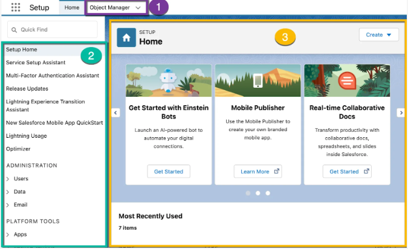

## Settings 

**Purpose of learning**
Once you have completed this unit, you will be able to:

- [Settings ] Locate and identify its main elements.
- Identify important menus when customizing your organization.
- Access menu items using [Quick Search ].

**Settings: New mission base**
- is where you can centrally customize, configure, and support your organization.
- it is important to be able to manage this area easily as it can do so much in the area. 

**Object Manager** is a place where you can view and customize standard and custom objects within your organization.
**Menu** shows a quick link to a series of pages where you can perform any operation, from managing users to changing security settings.
**Main window** The screen above shows [Settings ] homepage, but this is where you can see what you are currently working on.

**[Settings ] Get used to the menu**
The menu has three main categories: 
- **management:** This category is where you can manage your users and data. You can perform operations such as adding users, changing permissions, importing and exporting data, and creating email templates.
- **Platform tools:** Most of the customization is done with platform tools. You can view and manage data models, create applications, change user interfaces, release new features to users, and more. If you decide to work on program type development, manage the code with this [platform tool ].
- **Settings:** The last [Settings ] is a place to manage organizational information and organizational security. You can perform operations such as adding business hours, changing locales, and displaying your organization's history.

**Different Departments of the Platform**
| **#** | **Item**                            | **Useful reasons**                                                   |
| ----- | ----------------------------------- | -------------------------------------------------------------------- |
|       |                                     | - Get a glimpse of the organization.                                 |
| 1     | Organization information            | - Check your organization ID.                                        |
|       |                                     | - Check license information.                                         |
|       |                                     | - Monitor important limits such as data and file usage.              |
| ----- | ----------------------------------- | -------------------------------------------------------------------- |
|       |                                     | - Password reset                                                     |
| 2     | user                                | - Create new users and disable or freeze existing users.             |
|       |                                     | - Display information about the user.                                |
| ----- | ----------------------------------- | -------------------------------------------------------------------- |
|       |                                     | - Use your user profile to manage which users can see what.          |
| 3     | profile                             | - Create a custom profile.                                           |
| ----- | ----------------------------------- | -------------------------------------------------------------------- |
|       |                                     | - Check your organization's 6-month change history.                  |
| 4     | Reference to setting change history | - Check the modifier and the date and time of the change.            |
|       |                                     | - Troubleshoot organizational settings issues.                       |
| ----- | ----------------------------------- | -------------------------------------------------------------------- |
|       |                                     | - Check your organization's 6-month login history.                   |
| 5     | Login history                       | - Displays login data such as date and time, users and IP addresses. |
|       |                                     | - Use for security tracking and deployment monitoring purposes.      |
| ----- | ----------------------------------- | -------------------------------------------------------------------- |