## Manage user access

- go to the testing account
- https://wise-panda-9f3jl5-dev-ed.trailblaze.lightning.force.com/lightning/page/home

- open your account
- Gear icon Settings icon Click,[Setup (Settings )] Select.
- go to the **[Quick Find (Quick Search)]** 
- search for the **Users** then click Enter

- click the **view this page in Salesforce Classic.**
- click **New User** button
- Set the following information:

| **Field (Item)**                         | **Value (value)**      |
| ---------------------------------------- | ---------------------- |
| First Name (Name )      | Aaron |
| Last Name (Surname )        | Hartzler                   |
| Alias (aka )  | ahart (automatic input )2                      |
| Email (Email )  | (Please enter your own email address )                      |
| Username (Username )  | (Email address is entered automatically. Replace it using the format described in the note above )                      |
| Nickname (Nickname )  | ahartzler                      |
| Title (Position )  | Customer Support Rep(Customer Support )                      |
| Role (Roll )  | Customer Support, North America (Customer Support, North America )                     |
| User License (User License )  | Salesforce                      |
| Profile (Profile )  | Standard User (Standard User )                      |

- then click **Save** button

## Validate email address

- go to the **[Quick Find (Quick Search)]** 
- search for the **Users** then click Enter

- click the **view this page in Salesforce Classic.**
- look for your account name then click it.
- click verify at the email section

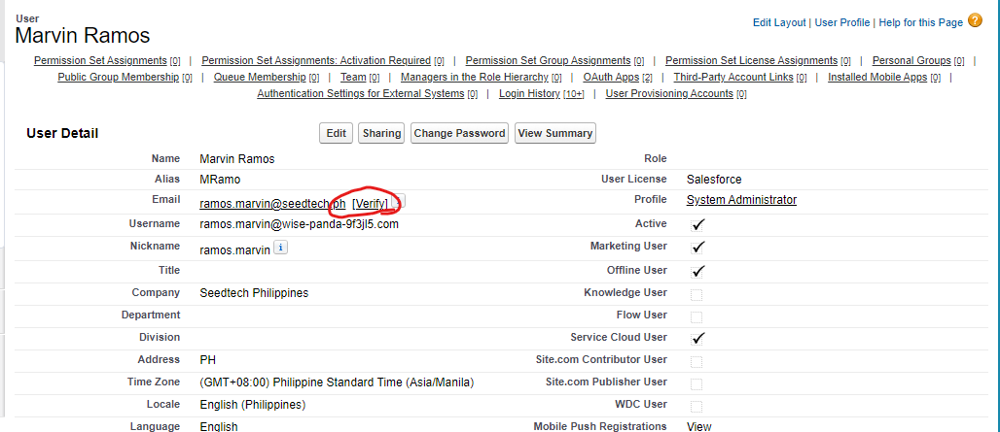

- then open your email and verify

## Chatter Management

- Chatter is a **private corporate social network**, similar to Facebook, Twitter or any social media platform. it is the links the employees of an organization with each other and let us share enterprise data and information among high-performing individuals and teams.
- Chatter also help the customer to interact to the executer of the company to resolve the problem that discuss the details of the products.
- Chatter helps you to collaborate with the people inside/within the organization. 

**why do we use chatter?**
- Post status updates regarding the day to day tasks.
- Share our ideas in real time.
- Private collaborate on the sensitive projects.
- Follow specific service records or sales cycles.
- Collaborate customers directly.

## Chatter Feature

- Feeds
    - it also known as a notification functionality
    - Feed is a stream of everything that is relevant to us in chatter
    - All updates and activities can be seen in the feed section.
    - it delivers the right content and insights to us when we need it and the way we need it.
    - it comprises with posts made by the people, objects we follow and group we are a member of. We can have a **full control** of what it goes into by following/joining what we need the mosts.
    - we can also filter the feed as we see fit to display all of the posts that we have subscribe to or only a few of them.

- Groups
    - it help organize the content and discussion
    - Each group can be a public or private
    - Each group has its own feed, and by joining a group, we get all posts from that group on our chatter feed.
    - We can also proactively navigate to any group and checkout whats there if we have a right permissions.

- Posts
    - We can posts anything a file, text post, picture, URL
    - Public posts can be made into groups or to people's profiles.
    - Everyone in a group, following a persons profile, can see the group activities.
    - we can also communicate with other people in a private message.
    - wa can also mention people in public posts to their attention to what we are posting, by adding '@' at the beginning of thier names.

- Likes and Bookmarks
    - we can interact with the posts by liking or bookmarking it.
    - bookmarking a post, we can save the post for refer later.
    - everything we bookmark will be in our bookmarked feed.

- Files
    - Files are the resource for recording data of a company
    - All files associated with a group can also be seen on the right.

- Topics
    - helps to organize the posts in a feed
    - if we follow the topic, posts tagged with that topic will appear in our feed.

- Business Objects
    - are entities that help the work happen in a company.
    - objects can be:
        - Account
        - Opportunities
        - Case
        - Campaign
    
- People and Profiles
    - a profile is a structure that defines users accessibility to objects and data. 

## Exercises

**Reference:** Manage Chatter | Customize an Org to Support a New Business Unit [YouTube](https://www.youtube.com/watch?v=qbe126dPOWM) 

**Follow trading partner records**

- open your account
- Gear icon Settings icon Click,[Setup (Settings )] Select.
- go to the **[Quick Find (Quick Search)]** 
- search for the **Service** then click Enter

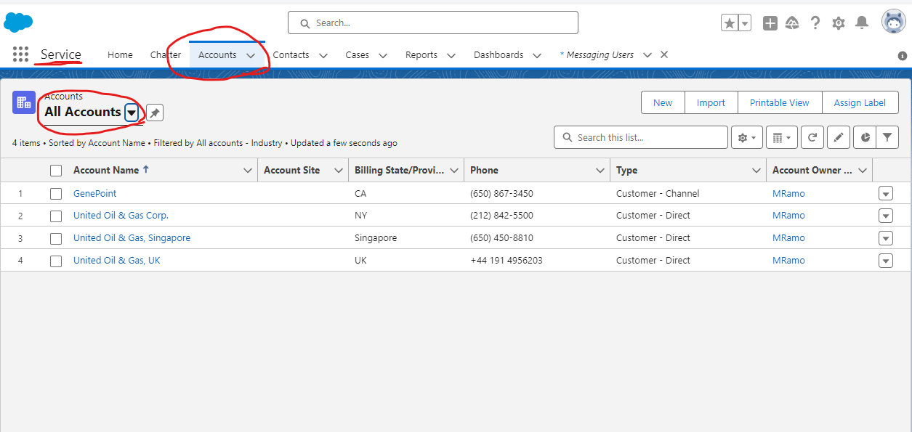

- you will see the list view
- filter it to the **All Account**
- then search for the **Edge Communications**

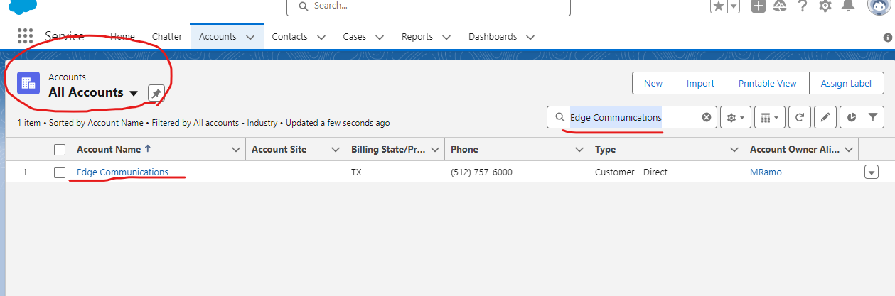

- then click the **Edge Communications**
- then look and click the **Follow** button

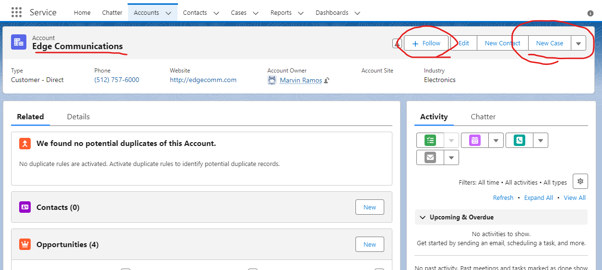

## Create a case with your trading partner Edge Communications.

- scroll down and look for cases
- then click the **New Case** button.
- add the following details:

| **Field (Item)**            | **Value (value)**                                             |
| --------------------------- | ------------------------------------------------------------- |
| Case Origin (Case source )  | Email (Email )                                                |
| Type (By species )          | Electronic (Electronic )                                      |
| Case Reason (Cause )        | Performance (Performance )                                    |
| Subject (Subject )          | Laptop not working(Laptop does not work )                     |
| Description (Description )  | Client new laptop not working(Your new laptop does not work ) |

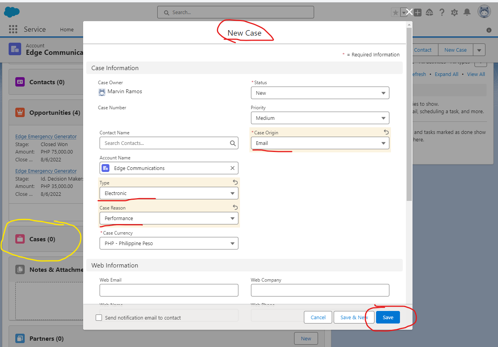

- then click the **Save** button.

## Create a Chatter group

- then go to the app launcher
- then search for **Groups**

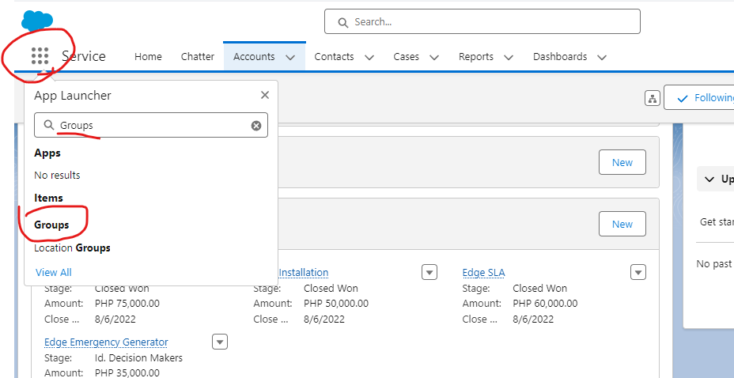

- then click the **New** button
- add the following the data:

| **Field (Item)**                   | **Value (value)**                                                                                                     |
|------------------------------------|-----------------------------------------------------------------------------------------------------------------------|
| Group Name (Group Name)            | Edge Communications Customer Support (Edge Communications Customer Support)                                           |
| Description (Description)          | Collaboration space for Customer Support teams related to Edge Communications (Customer Support Team Collaboration Space Related to Edge Communications) |
| Access Type (By Access Species)    | Private (Private)                                                                                                     |
| Allow Customers (Allow Customers)  | Select (On)                                                                                                           |

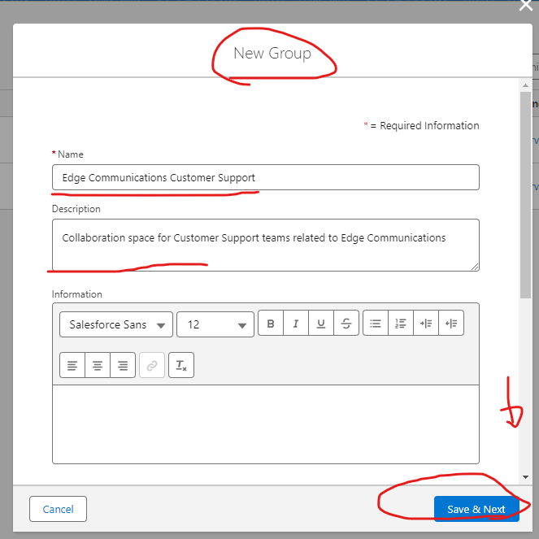

- click **Save&Next** button
- upload group image and click **Next** button
- then add members just add you created user account
- click **Add** button
- click **Done** button

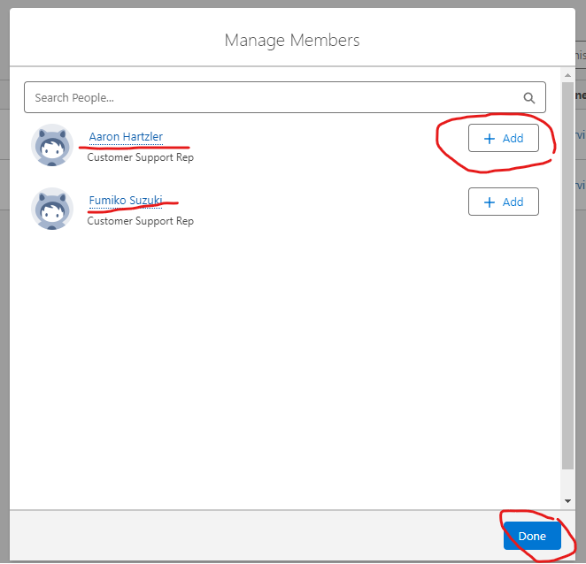

- saving click the **Share Update** button
- then add the following text **Welcome to the Edge Communications Customer Support group.We will use this space to share efficiency and workflow improvement ideas for Edge Communications customer support cases.**
- click the **Share** button

## Ask Member to join in the group

- look for the **Poll** button
- then click the **Ask** button

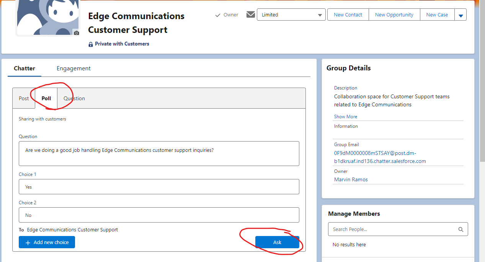

## Change data model

- open your account
- Gear icon Settings icon Click,**[Setup (Settings )]** Select.
- then go to the **[Object Manager (Object Manager )]** 
- then go to the **[Account (Trading partner )]** 
- then go to the **[Fields & Relationships (Items and Relations )]** 

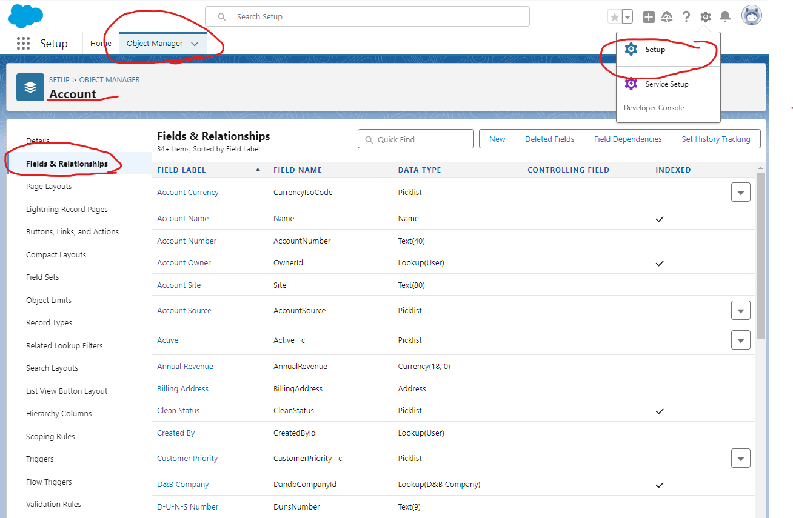

- then click the **New** button
- click the **view this page in Salesforce Classic.**
- select the **Date**
- then click the **Next** button
- add the following details:

| **Field (Item)**                      | **Value (value)**                        |
| ------------------------------------- | ---------------------------------------- |
| Field Label (Display label for items )| Support Plan Start Date                  |
| Description (Description )            | Start date of current support plan       |
| Help Text (Help Text )                | When did the current support plan begin? |

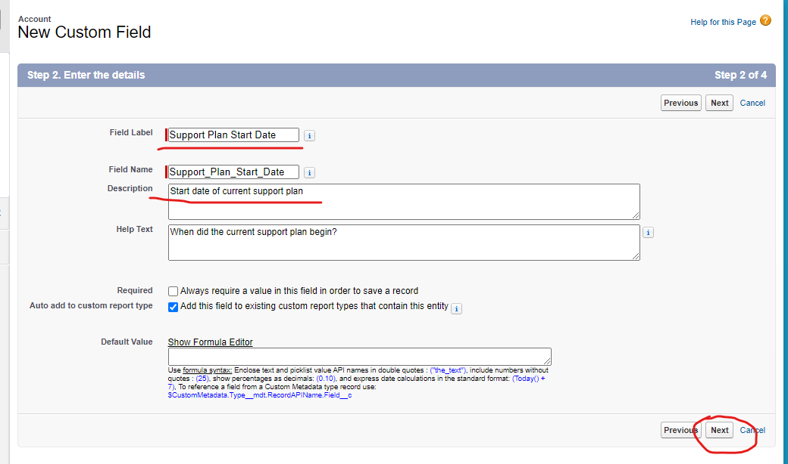

- then look for the **[Custom: Support Profile (Custom: Support Profile )]** and **[System Administrator (System Administrator )]**
- then uncheck the read-only box

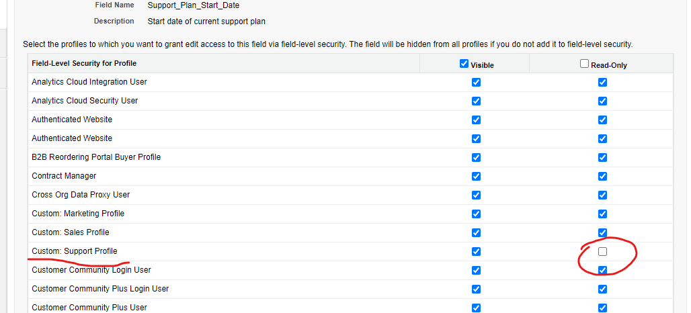
- then click the **Save** button

## Create a linked selection list

- open your account
- Gear icon Settings icon Click,**[Setup (Settings )]** Select.
- then go to the **[Object Manager (Object Manager )]**