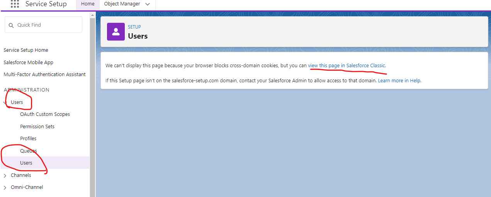

## Manage user access

- go to the testing account
- https://wise-panda-9f3jl5-dev-ed.trailblaze.lightning.force.com/lightning/page/home

- open your account
- Gear icon Settings icon Click,[Setup (Settings )] Select.
- go to the **[Quick Find (Quick Search)]** 
- search for the **Users** then click Enter

- click the **view this page in Salesforce Classic.**
- click **New User** button
- Set the following information:

| **Field (Item)**                         | **Value (value)**      |
| ---------------------------------------- | ---------------------- |
| First Name (Name )      | Aaron |
| Last Name (Surname )        | Hartzler                   |
| Alias (aka )  | ahart (automatic input )2                      |
| Email (Email )  | (Please enter your own email address )                      |
| Username (Username )  | (Email address is entered automatically. Replace it using the format described in the note above )                      |
| Nickname (Nickname )  | ahartzler                      |
| Title (Position )  | Customer Support Rep(Customer Support )                      |
| Role (Roll )  | Customer Support, North America (Customer Support, North America )                     |
| User License (User License )  | Salesforce                      |
| Profile (Profile )  | Standard User (Standard User )                      |

- then click **Save** button

## Validate email address

- [Setup (Settings )] [Users (User )] Click.
- My nameClick to open [Advanced User Details (Advanced user details)].
- Next to email address [Verify (Verification )] Click. Memo: If you already see [Verified (Verified )] next to your email address, you don't have to do anything as this work is done.
- In popup window [OK] Click.
- Check your email address and click the validation link.