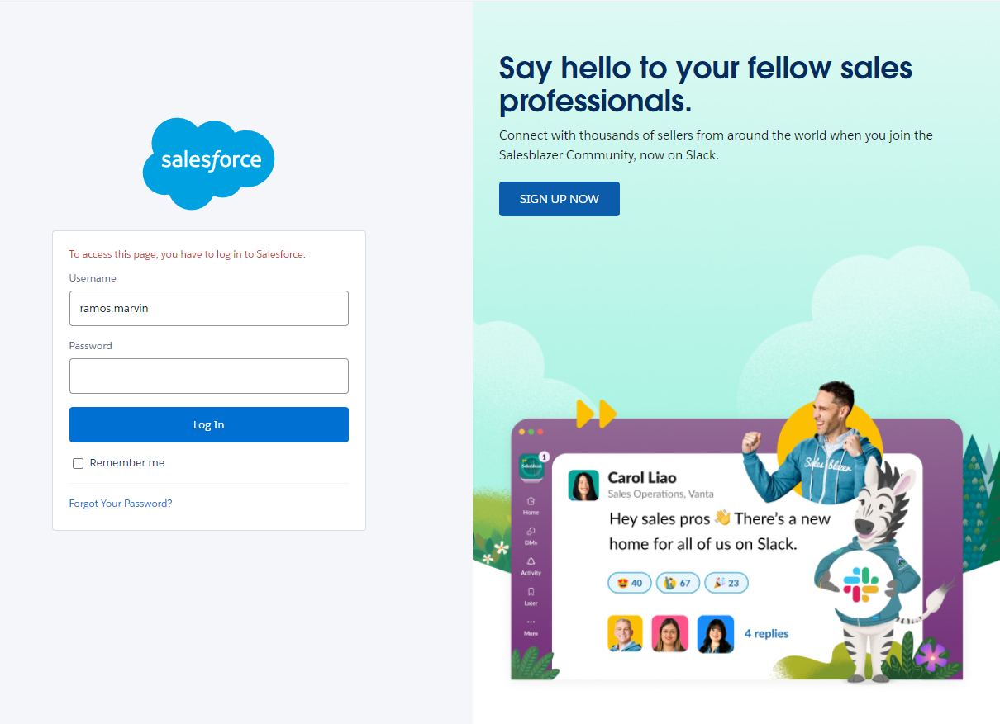

## Hands on Challenge
it can be used if you have a sales in different countries

## Youtube
How to activate multiple currencies in Salesforce [YouTube](https://www.youtube.com/watch?v=6m9YhQEHhC8).
Set Up the Exchange Rate In Prepare Your Salesforce Org for Users [YouTube](https://www.youtube.com/watch?v=hX3hqIdpnN4).
Set Up the Exchange Rate In Prepare Your Salesforce Org for Users [YouTube](https://www.youtube.com/watch?v=hX3hqIdpnN4).

## Validation of multi-currency
- go to the testing account
- https://wise-panda-9f3jl5-dev-ed.trailblaze.lightning.force.com/lightning/page/home

- open your account
- Gear icon Settings icon Click,[Setup (Settings )] Select.

[Salesforce Organization](../images/salesforce-organization-preparation-for-users/saleforce-2.png "Salesforce Organization")

- [Quick Find (Quick Search )] In Box Company Information Enter (organization information )
- [Company Information (Organization Information )] Select.

[Salesforce Organization](../images/salesforce-organization-preparation-for-users/saleforce-3.png "Salesforce Organization")

- click the **view this page in Salesforce Classic.**
- click the **Edit** button

[Salesforce Organization](../images/salesforce-organization-preparation-for-users/saleforce-4.png "Salesforce Organization")

- go down and find the **Currency Settings**
- then if you want to activate the currency just click the **Activate Multiple Currencies** checkbox.

[Salesforce Organization](../images/salesforce-organization-preparation-for-users/saleforce-5.png "Salesforce Organization")

- then click **Save button**
- then go back to the **Company Information**
- then click the **Currency Setup (Currency Settings )** button

[Salesforce Organization](../images/salesforce-organization-preparation-for-users/saleforce-6.png "Salesforce Organization")

- then click **New button**
- Set the euro using the following information:

| **Field (Item)**                         | **Value (value)**      |
| ---------------------------------------- | ---------------------- |
| Currency Type (By currency species)      | **EUR – Euro (Euro)**  |
| Conversion Rate (Conversion rate)        | 1.5                    |
| Decimal Places (Decimal point position)  | 2                      |

- then click **Save button**

## Test the exchange rate in a new business talk.
- go to the main home page
- then find the app launcher
- then look for the sales
- then click the sales

[Salesforce Organization](../images/salesforce-organization-preparation-for-users/saleforce-7.png "Salesforce Organization")

- look for **Close Deal**
- then click the **View Opportunities**

[Salesforce Organization](../images/salesforce-organization-preparation-for-users/saleforce-8.png "Salesforce Organization")

- look for **New button**
- then click it
- then enter the following details

| **Field (Item)**                               | **Value (value)**                                            |
| ---------------------------------------------- | ------------------------------------------------------------ |
| Opportunity Name (Trade name)                  | Euro Currency Test **(Euro currency test)**                  |
| Account Name (Trading Partner Name)            | United Oil & Gas, UK **(United Oil & Gas (United Kingdom))** |
| Opportunity Currency (Business talk currency)  | Euro **(Euro)**                                              |
| Close Date (Scheduled completion date)         | End of this month **(End of this month)**                    |
| Stage (Phase)                                  | Closed Won **(Commercialization)**                           |
| Amount (Amount)                                | 10000 **(0 is 4 pieces)**                                    |

[Salesforce Organization](../images/salesforce-organization-preparation-for-users/saleforce-10.png "Salesforce Organization")

- then click **Save button**

## Exchange rate update
- open your account
- Gear icon Settings icon Click,[Setup (Settings )] Select.

[Salesforce Organization](../images/salesforce-organization-preparation-for-users/saleforce-2.png "Salesforce Organization")

- go and find the [Quick Find (Quick Search )]
- then put type **Manage Currencies** in the search box 
- then press enter (Currency Management )

**Note:** [Quick Find (Quick Search )] [Manage Currencies (If you don't see currency management )]Company Information
[Salesforce Organization](../images/salesforce-organization-preparation-for-users/saleforce-11.png "Salesforce Organization")

- click the **view this page in Salesforce Classic.**
- click the **Edit Rates** button

[Salesforce Organization](../images/salesforce-organization-preparation-for-users/saleforce-12.png "Salesforce Organization")

- change the currencies base in the country you added
- then click **Save button**

## Test the exchange rate in a business talk.
- go to the main home page
- then find the app launcher
- then look for the sales
- then click the sales

[Salesforce Organization](../images/salesforce-organization-preparation-for-users/saleforce-7.png "Salesforce Organization")

- look for **Close Deal**
- then click the **View Opportunities**

[Salesforce Organization](../images/salesforce-organization-preparation-for-users/saleforce-14.png "Salesforce Organization")

- then just compare it to the previous
- then if its ok
- you completed the task

## Exchange rate update based on the conversion rate according to the calendar date
- open your account
- Gear icon Settings icon Click,[Setup (Settings )] Select.

[Salesforce Organization](../images/salesforce-organization-preparation-for-users/saleforce-2.png "Salesforce Organization")

- go and find the [Quick Find (Quick Search )]
- then put type **Manage Currencies** in the search box 
- then press enter (Currency Management )

**Note:** [Quick Find (Quick Search )] [Manage Currencies (If you don't see currency management )]Company Information
[Salesforce Organization](../images/salesforce-organization-preparation-for-users/saleforce-11.png "Salesforce Organization")

- click the **view this page in Salesforce Classic.**
- click the **Enable** button of the **Advanced Currency Management is not enabled**

[Salesforce Organization](../images/salesforce-organization-preparation-for-users/saleforce-15.png "Salesforce Organization")

- click the **Yes, i want to enable advance currency management** checkbox
- click the **Enable** button

[Salesforce Organization](../images/salesforce-organization-preparation-for-users/saleforce-16.png "Salesforce Organization")

- then look for the **Manage Date Exchange Rates** button

[Salesforce Organization](../images/salesforce-organization-preparation-for-users/saleforce-17.png "Salesforce Organization")

- click the checkbox
- click the **Continue** button

[Salesforce Organization](../images/salesforce-organization-preparation-for-users/saleforce-18.png "Salesforce Organization")

## Update the Exchange Rate with ACM
- open your account
- Gear icon Settings icon Click,[Setup (Settings )] Select.

[Salesforce Organization](../images/salesforce-organization-preparation-for-users/saleforce-2.png "Salesforce Organization")

- go and find the [Quick Find (Quick Search )]
- then put type **Manage Currencies** in the search box 
- then press enter (Currency Management )

**Note:** [Quick Find (Quick Search )] [Manage Currencies (If you don't see currency management )]Company Information
[Salesforce Organization](../images/salesforce-organization-preparation-for-users/saleforce-11.png "Salesforce Organization")

- click the **view this page in Salesforce Classic.**
- click the **Enable** button of the **Advanced Currency Management is not enabled**

[Salesforce Organization](../images/salesforce-organization-preparation-for-users/saleforce-15.png "Salesforce Organization")

- click the **Yes, i want to enable advance currency management** checkbox
- click the **Enable** button
- then look for the **Manage Date Exchange Rates** button

[Salesforce Organization](../images/salesforce-organization-preparation-for-users/saleforce-17.png "Salesforce Organization")

- **[New Exchange Rates (New conversion rate )]** Click to enter the item.
    - Start Date (Start date ): (First day of the following month )
    - Euro (Euro ): 1.13
- then click **Save button**
- then go back to the **Test the exchange rate in a business talk** to test